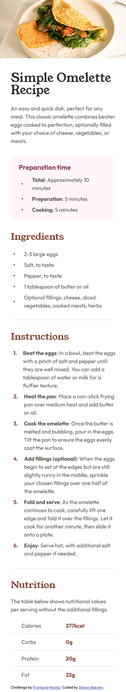

# Frontend Mentor - Recipe page solution

This is a solution to the [Recipe page challenge on Frontend Mentor](https://www.frontendmentor.io/challenges/recipe-page-KiTsR8QQKm). Frontend Mentor challenges help you improve your coding skills by building realistic projects.

## Table of contents

- [Overview](#overview)
  - [The challenge](#the-challenge)
  - [Screenshots](#screenshot)
    - [Desktop screenshot](#desktop-screenshot)
    - [Mobile screenshot](#mobile-screenshot)
  - [Links](#links)
- [My process](#my-process)
  - [Built with](#built-with)
- [Author](#author)

## Overview

### Screenshots

#### Desktop screenshot

#### Mobile screenshot

### Links

- Solution URL: https://github.com/snguyen56/recipe-page-vanilla
- Live Site URL: https://snguyen56.github.io/recipe-page-vanilla/

## My process

### Built with

- HTML
- CSS
- Semantic HTML5 markup
- Mobile-first workflow
- [modern-normalize](https://github.com/sindresorhus/modern-normalize) - Normalized CSS File

## Author

- Website - https://snguyen56.github.io/
- Github - https://github.com/snguyen56
- LinkedIn - [Steven Nguyen](https://www.linkedin.com/in/steven-nguyen-bb5568216/)
- Frontend Mentor - [@snguyen56](https://www.frontendmentor.io/profile/snguyen56)
